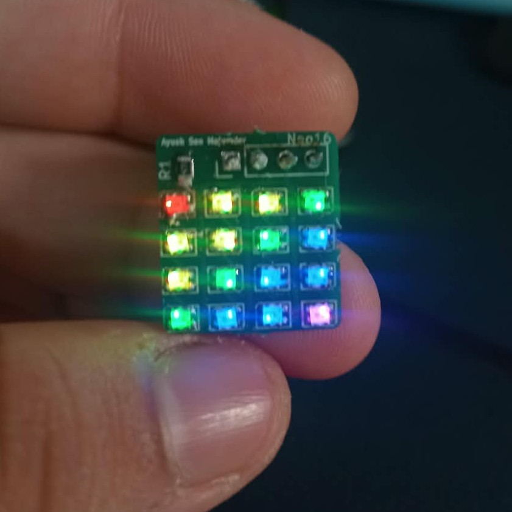
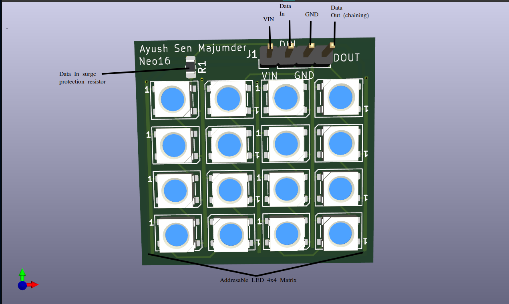
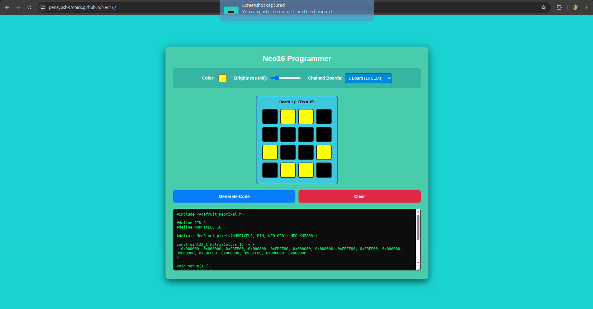
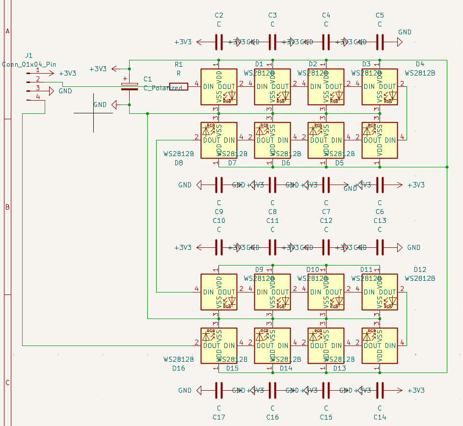
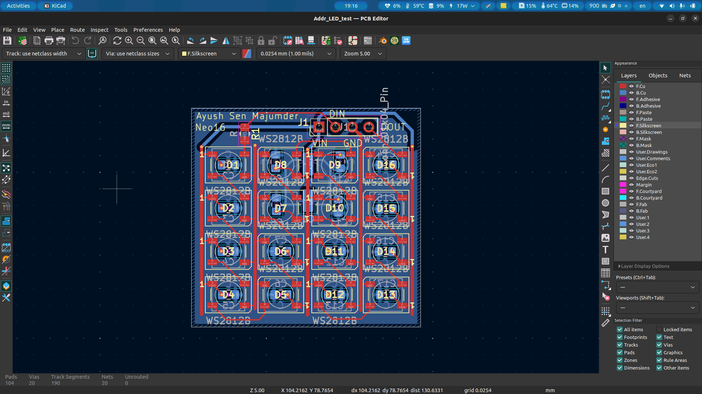
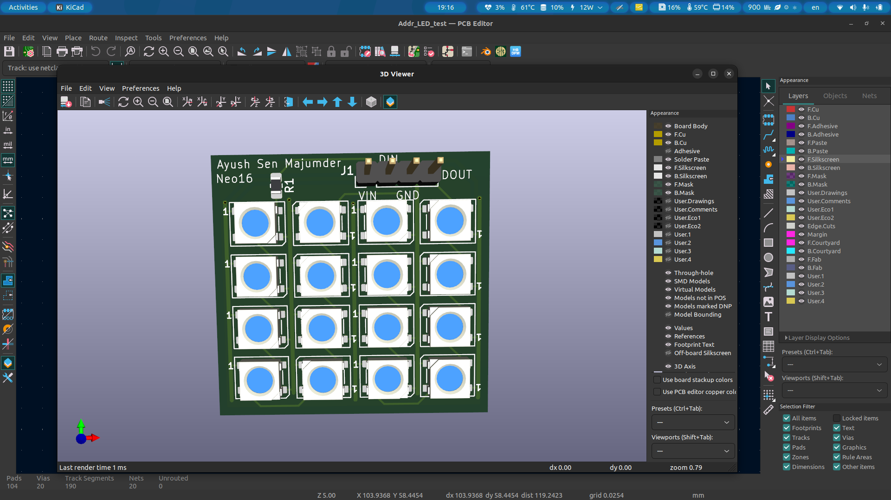
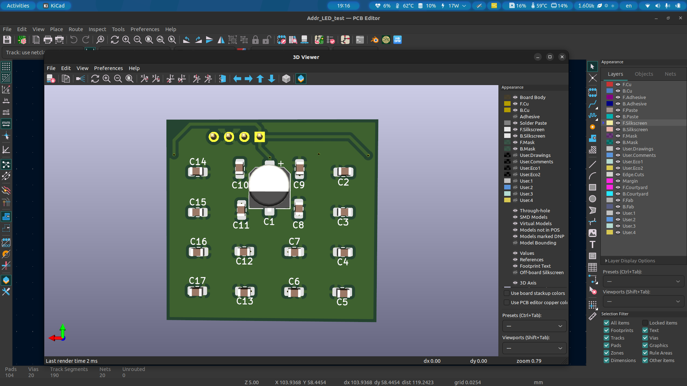
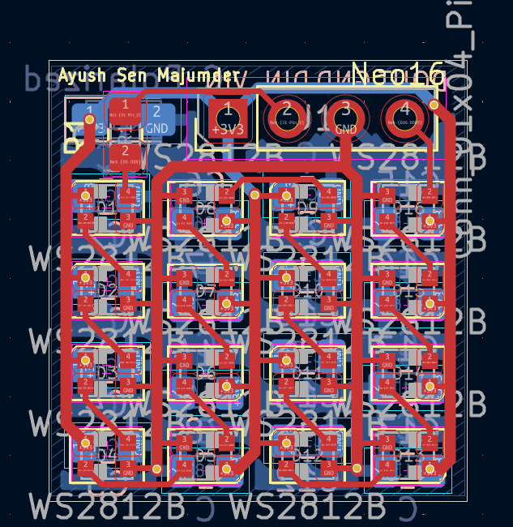
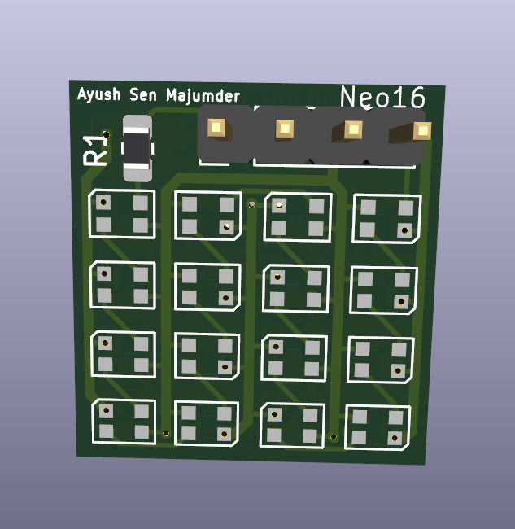
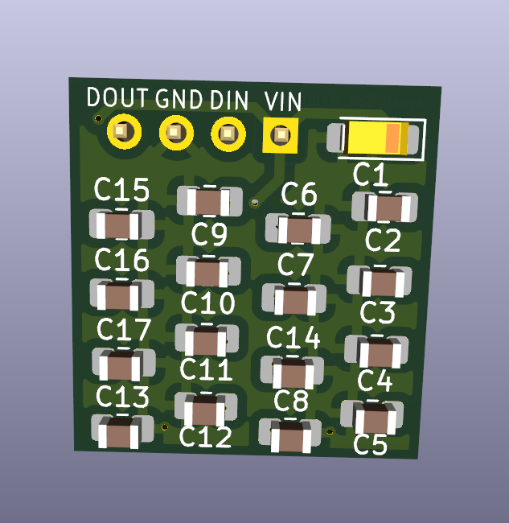

# Neo16

A 4x4 matrix panel of 16 addressable LEDs, which can be used to display small graphics, animations, or keyboard characters. These addressable LEDs (also refered to as NeoPixels) are RGB and so can take more than one colour. These panels can also be 'daisy-chained' together, so that many panels can be used at once. The biggest feature is how it only needs one data pin from a microcontroller/dev board to start displaying. There are multiple sizes available. 

# How to use the Neo16

Here is a 3D labelled diagram of the panel:

On the top right corner, there are 4 headers. They are voltage in (VIN), data in (DIN), ground (GND), and data out (DOUT), in that order from left to right.

Connect power to the VIN and GND pins accordingly; it can take 3.3V or 5V, but make sure your DIN pin input from the microcontroller/dev board matches this voltage (for example: VIN-5V then DIN-5V). Connect DIN to any one digital pin on the microcontroller/dev board. And that's about it for the wiring; it is really simple to hook up. 

For connecting many panels in series, setup the first panel as mentioned above. Then connect the subsequent panels to power accordingly. Then, use a jumper or a wire to connect the DOUT pin on the main, first panel (which is connected to the microcontroller) to the DIN pin on the next panel. Continue this chain of DOUT to DIN for as many times as needed (do not worry about limits, as at this scale the limits are very far away.)

## Programming
### Usign Neo16 Programmer website: 
The Neo16 comes with a [programmer website](https://penayush-tronics.github.io/Neo16/) where you can choose colours, set brightness of the LEDs, and make patterns on a digital copy of the 4x4 matrix of LED, and convert it into Arduino Code. Here is the interface: 
 

In the center is the matrix. On the top there are settings such as colour and brightness. You can also choose how many boards are daisy-chained together and program them at once. 

To select patterns, click on the cells of the matrix which you want to turn on. 

Click Generate to generate the code. Copy it into Arduino IDE, upload and see it on the Neo16!

#### An example sketch for arduino IDE along with an arduino board can be found [here](Neo16_Example)

**NOTE: This code uses the Adafruit_Neopixel library, and so it needs to be installed in your IDE. Also, this uses digital pin 9 on arduino for Data IN, but you can change this.**

### Programming by yourself
 When programming for this panel, keep in mind the LED matrix is in a specific order. The first LED is the top left corner, and then it continues down the column as 2,3,4. The 5th led then is the adjacent LED in the next column, and then 6,7,8 is up the column. Then it continues, 'snaking' up and down each column. If this is confusing, just remember the order is like how you write the letter ' W '.

# What are Addressable LEDs?
  
  Addressable LEDs are like those smart LED bulbs at home, which have RGB colours. These LEDs are much smaller and usually for multi-colour pixel displays. They are called 'addressable' as you can assign each LED's colour individually, so each pixel can be a seperate colour if needed. The coolest feature is how the data pins of these LEDs can be connected in series, and then still each LED is individually addressable. If you want to know about how this works in detail, you can learn about it [here](https://www.youtube.com/watch?v=2tTsV290nTo).

# Schematics

Here are the schematics for this board:

Schematics available in the [Schematics folder](PCB/Schematics)

# PCB and sizes

There are currently 2 sizes available:
  - panel with 5mmx5mm addressable LEDs (Large size)
  - panel with 2mmx2mm addressable LEDs (Small size)

Large size:
  
  PCB in Kicad-

  

  Front side-
  
  

  Back side-

  

Small size:
  
  PCB in Kicad-

  

  Front side-
  
  

  Back side-

  

All PCB Gerbers of all sizes available in [PCB folder](PCB), [Gerbers directory](PCB/Gerbers_and_KicadPCB)

# Video Demo

https://github.com/user-attachments/assets/8053cdf7-2f21-4381-b544-3c394bac34a4

# Why I made this board

Recently, I had an idea for a personal project, and I needed these addressable LEDs for that project. So, I requried small panels for personal use as well as for testing purposes. Yet, I was unable to find a suitable 4x4 matrix for my purposes, and other alternatives were bigger and way too expensive. So, I chose to make one myself; not just for myself but, also for anyone else looking for a small 4x4 matrix of these addressable LEDs (especially the 2mm version).

# Bill of Materials

This BOM is for 1 panel, except for the PCB as it has minimum quantity of 5.

This same BOM is available in [Neo16BOM.csv](Neo16 BOM.csv)

| Sl No. | Component Description | Qty | Price (INR) | Ext Price (INR) | Link |
| :---: | :--- | :---: | :---: | :---: | :--- |
| **1** | WS2812B SMD2020 Addressable RGB LED (for 2mm large size) | 16 | 7.65 | 122.40 | [Quartz Components](https://quartzcomponents.com/products/ws2812b-smd2020-addressable-rgb-pixel-led-smd-package?variant=45110136668394) |
| **2** | WS2812B SMD5050 Addressable RGB LED (for 5mm large size) | 16 | 3.60 | 57.60 | [Quartz Components](https://quartzcomponents.com/products/ws2812b-smd5050-addressable-rgb-led-neopixel-led?pr_prod_strat=jac&pr_rec_id=f8f2799bf&pr_rec_pid=8521263513834&pr_ref_pid=8521726165226&pr_seq=uniform) |
| **3** | 1000nF 50V 0805 X7R SMD Capacitor (Pack of 5 Pieces) | 4 | 13.50 | 60.00 | [Quartz Components](https://quartzcomponents.com/products/1uf-1000nf-50v-0805-x7r-smd-capacitor-pack-of-5-pieces?variant=43526976504042) |
| **4** | 470 $\Omega$ 5% SMD Resistor 0805 (Pack of 20 Pieces) | 1 | 8.00 | 8.00 | [Quartz Components](https://quartzcomponents.com/products/470ohm-470e-5-smd-resistor-0805-pack-of-20-pieces?variant=43515854749930) |
| **5** | TLJA107M006R0800 100uF 6.3V CASE-A-3216-18(mm) Tantalum Capacitors ROHS (for 2mm small size) | 1 | 25.00 | 25.00 | [Robu.in](https://robu.in/product/tlja107m006r0800-kyocera-avx-100uf-6-3v-800m%cf%89100khz-%c2%b120-case-a-3216-18mm-tantalum-capacitors-rohs/) |
| **6** | UUD0J101MCL1GS 100uF 6.3V SMD, D6.3xL5.8mm Aluminum Electrolytic Capacitors - SMD ROHS (for 5mm large size) | 1 | 31.00 | 31.00 | [Robu.in](https://robu.in/product/uud0j101mcl1gs-nichicon-100uf-6-3v-115ma120hz-%c2%b120-smdd6-3xl5-8mm-aluminum-electrolytic-capacitors-smd-rohs/) |
| **7** | PCB Fabrication | 5 | 159.80 | 943 (799 + 18% tax) | [Lion Circuits](https://www.lioncircuits.com/) |
| **8** | 4-pin Header (optional) | 1 | 2.00 | 2.00 | [Robu.in](https://robu.in/product/hb-ph3-25414pb2gop-hanbo-gold-250v-3a-direct-insert-2-54mm-4p-6mm-40%e2%84%83105%e2%84%83-3mm-2-54mm-brass-black-single-row-1x4p-2-54mm-pluginp2-54mm-pin-headers-rohs/) |

Total per board cost varies from size to size:
  
  For the **small 2mm size**: 217.4 INR for components + 188.6 INR for PCB -> **406 INR   ~ $4.30 USD**
  
  For the **large 5mm size**: 158.6 INR for components + 188.6 INR for PCB -> **347.2 INR ~ $3.65 USD**
    

